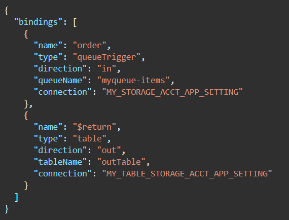
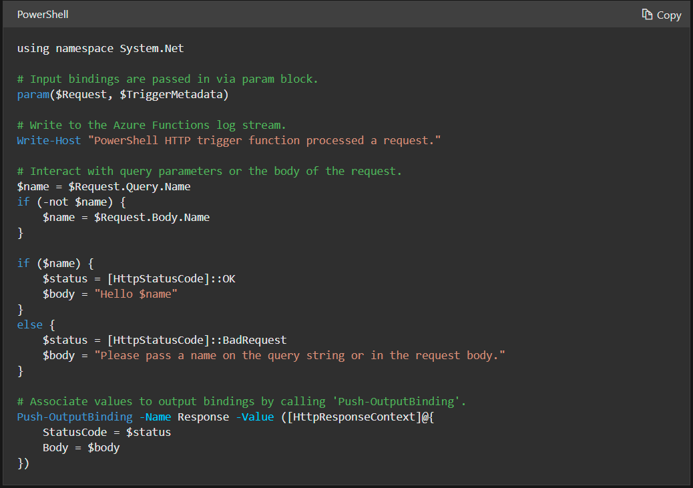
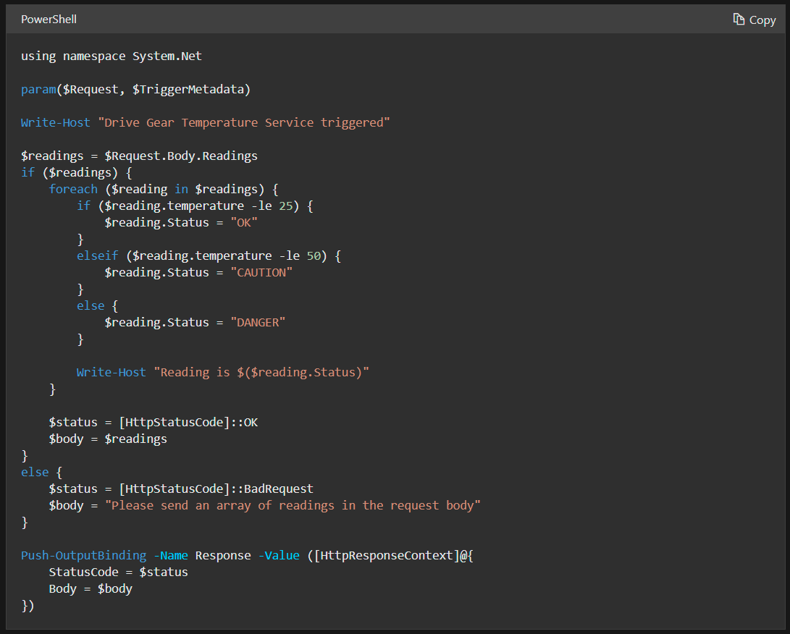

# [Create serverless applications](https://docs.microsoft.com/en-us/learn/paths/create-serverless-applications/)

### [Choose the best Azure service to automate your business processes](https://docs.microsoft.com/en-us/learn/modules/choose-azure-service-to-integrate-and-automate-business-processes/)
- design-first
    - Logic Apps
        - over 200 connectors (interface to an external service)
        - you can create connectors if your system exposes a REST API
        - code editing is possible
    - Microsoft Power Automate
        - create workflow with no coding/IT experience
        - types
            - automated: triggered by an event
            - button click starts workflow
            - schedule: runs on a schedule
            - business process
- code-first
    - WebJobs
        - part of Azure App Service
        - allows developers to detail retry policies
        - types
            - continuous
            - triggered
        - can write in multiple languages
        - you can use the WebJobs SDK if you're programming the workflow in C# or VB.NET
        - package manager: NuGet
    - Azure Functions
        - you can write a function in C#, Java, JavaScript, PowerShell, Python, or any of the languages in [Supported languages in Azure Functions](https://docs.microsoft.com/en-us/azure/azure-functions/supported-languages)
        - templates
            - HTTPTrigger
            - TimerTRigger
            - BlobTrigger: triggers when a new blob is added to an Azure Storage account
            - CosmosDBTrigger: triggers in response to new/updates docs in a NoSQL DB
        - package managers: NuGet and NPM
- their similarities
    - accept inputs
    - run actions
    - include conditions
    - produce outputs
    - run on a schedule or be triggered by some event
- Azure Functions and Logic Apps scale automatically
- 

### [Create serverless logic with Azure Functions](https://docs.microsoft.com/en-us/learn/modules/create-serverless-logic-with-azure-functions/)
- serverless compute: can be thought of function as a service (FaaS)
- features of serverless compute
    - scales automatically
    - pay for time running
    - stateless
    - even driven
    - maximum of 10 minutes that the function can be run for
    - if it's executed often it might be cheaper to run on a VM
    - you can move your function to a traditional compute environment
- Azure Functions service plans
    - consumption plan: max timeout of 10 min. and stateless
    - Azure App Services plan: run your function on a VM, stateful, no timeout
- triggers
    - blob
    - CosmosDB
    - Event Hub
    - HTTP
    - Microsoft Graph event
    - Queue Storage
    - message from a Service Bus queue
    - timer
- binding: defines what happens between when input is received and data is outputted
- functions can have multiple bindings but only one trigger
- a group of functions is called a Function App
- 
- logging
    - JS: `context.log('Enter your logging statement here');`
    - C#: `log.LogInformation("Enter your logging statement here");`
    - PowerShell: `Write-Host "Enter your logging statement here"`
- PowerShell template for HTTP trigger Function APP
    - 
- authorization levels for HTTP requests
    - anonymous: no key required
    - admin: there is one master key
    - function: function-specific key
- test the function with a cURL command: `curl --header "Content-Type: application/json" --header "x-functions-key: <your-function-key>" --request POST --data "{\"name\": \"Azure Function\"}" <your-https-url>`
- PowerShell business logic
    - 

### [Execute an Azure Function with triggers](https://docs.microsoft.com/en-us/learn/modules/execute-azure-function-with-triggers/)
- timer trigger
    - you need to pass in a timestamp parameter name, so you can access the trigger in the code
    - and you need to pass in a CRON expression, which is the time interval for the timer
        - `{second} {minute} {hour} {day} {month} {day of the week}`
        - `0 */5 * * * *` executes the function every 5 minutes
        - `*`: every value in the field
        - `,`: separates values, e.g. 1,3 in the day of the week field means "Mondays and Wednesdays"
        - `-`: specifies a range
        - `/`: specifies an increment, e.g. */5 in the minute field means "every 5 minutes"
- HTTP trigger
    - you can customize the HTTP trigger
        - filter which types of requests trigger the function
        - require requests to have an auth key
            - two types of keys
                - host: these keys can authorize requests for all functions in an app
                - function: these keys can authorize requests for only one function
            - three authorization levels you can set on the function itself
                - function: key-based, must supply either a host or function key
                - admin: key-based, must supply a host key
                - anonymous: no key required
        - return data back to the caller
        - use URL route templates
- blob trigger
    - function triggers when a blod gets uploaded to a storage account
    - you need to specify the path that you want to monitor
        - e.g. `samples-workitems/{name}`, or `samples-workitems/{name}.png` if you only want to trigger on png uploads
        - `name` is a parameter for the file name that you use as a variable in the function logic

### [Chain Azure Functions together using input and output bindings](https://docs.microsoft.com/en-us/learn/modules/chain-azure-functions-data-using-bindings/)
- 

### [Create a long-running serverless workflow with Durable Functions](https://docs.microsoft.com/en-us/learn/modules/create-long-running-serverless-workflow-with-durable-functions/)

### [Develop, test, and publish Azure Functions by using Azure Functions Core Tools](https://docs.microsoft.com/en-us/learn/modules/develop-test-deploy-azure-functions-with-core-tools/)

### [Develop, test, and deploy an Azure Function with Visual Studio](https://docs.microsoft.com/en-us/learn/modules/develop-test-deploy-azure-functions-with-visual-studio/)

### [Monitor GitHub events by using a webhook with Azure Functions](https://docs.microsoft.com/en-us/learn/modules/monitor-github-events-with-a-function-triggered-by-a-webhook/)

### [Enable automatic updates in a web application using Azure Functions and SignalR Service](https://docs.microsoft.com/en-us/learn/modules/automatic-update-of-a-webapp-using-azure-functions-and-signalr/)

### [Expose multiple Azure Function apps as a consistent API by using Azure API Management](https://docs.microsoft.com/en-us/learn/modules/build-serverless-api-with-functions-api-management/)

### [Build serverless apps with Go](https://docs.microsoft.com/en-us/learn/modules/serverless-go/)
