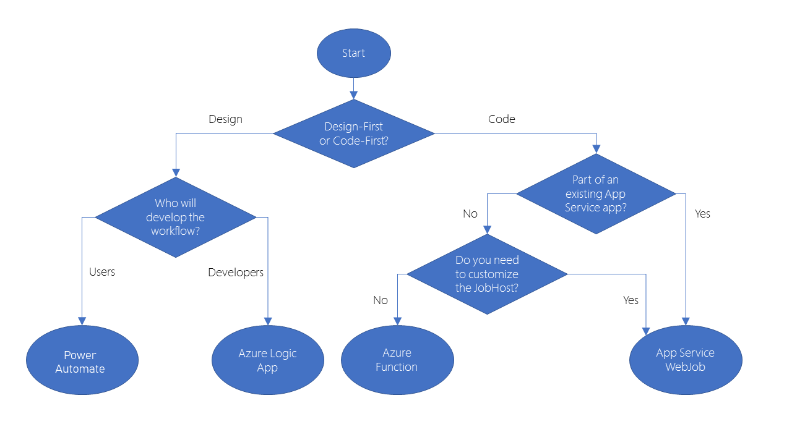

# [Create serverless applications](https://docs.microsoft.com/en-us/learn/paths/create-serverless-applications/)

### [Choose the best Azure service to automate your business processes](https://docs.microsoft.com/en-us/learn/modules/choose-azure-service-to-integrate-and-automate-business-processes/)
- design-first
    - Logic Apps
        - over 200 connectors (interface to an external service)
        - you can create connectors if your system exposes a REST API
        - code editing is possible
    - Microsoft Power Automate
        - create workflow with no coding/IT experience
        - types
            - automated: triggered by an event
            - button click starts workflow
            - schedule: runs on a schedule
            - business process
- code-first
    - WebJobs
        - part of Azure App Service
        - allows developers to detail retry policies
        - types
            - continuous
            - triggered
        - can write in multiple languages
        - you can use the WebJobs SDK if you're programming the workflow in C# or VB.NET
        - package manager: NuGet
    - Azure Functions
        - you can write a function in C#, Java, JavaScript, PowerShell, Python, or any of the languages in [Supported languages in Azure Functions](https://docs.microsoft.com/en-us/azure/azure-functions/supported-languages)
        - templates
            - HTTPTrigger
            - TimerTRigger
            - BlobTrigger: triggers when a new blob is added to an Azure Storage account
            - CosmosDBTrigger: triggers in response to new/updates docs in a NoSQL DB
        - package managers: NuGet and NPM
- their similarities
    - accept inputs
    - run actions
    - include conditions
    - produce outputs
    - run on a schedule or be triggered by some event
- Azure Functions and Logic Apps scale automatically
- 

### [Create serverless logic with Azure Functions](https://docs.microsoft.com/en-us/learn/modules/create-serverless-logic-with-azure-functions/)

### [Execute an Azure Function with triggers](https://docs.microsoft.com/en-us/learn/modules/execute-azure-function-with-triggers/)

### [Chain Azure Functions together using input and output bindings](https://docs.microsoft.com/en-us/learn/modules/chain-azure-functions-data-using-bindings/)

### [Create a long-running serverless workflow with Durable Functions](https://docs.microsoft.com/en-us/learn/modules/create-long-running-serverless-workflow-with-durable-functions/)

### [Develop, test, and publish Azure Functions by using Azure Functions Core Tools](https://docs.microsoft.com/en-us/learn/modules/develop-test-deploy-azure-functions-with-core-tools/)

### [Develop, test, and deploy an Azure Function with Visual Studio](https://docs.microsoft.com/en-us/learn/modules/develop-test-deploy-azure-functions-with-visual-studio/)

### [Monitor GitHub events by using a webhook with Azure Functions](https://docs.microsoft.com/en-us/learn/modules/monitor-github-events-with-a-function-triggered-by-a-webhook/)

### [Enable automatic updates in a web application using Azure Functions and SignalR Service](https://docs.microsoft.com/en-us/learn/modules/automatic-update-of-a-webapp-using-azure-functions-and-signalr/)

### [Expose multiple Azure Function apps as a consistent API by using Azure API Management](https://docs.microsoft.com/en-us/learn/modules/build-serverless-api-with-functions-api-management/)

### [Build serverless apps with Go](https://docs.microsoft.com/en-us/learn/modules/serverless-go/)
