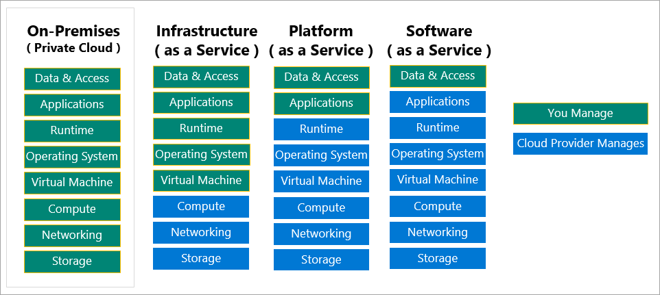

# [Azure Fundamentals part 1: Describe core Azure concepts](https://docs.microsoft.com/en-us/learn/paths/az-900-describe-cloud-concepts/)

### [Introduction to Azure fundamentals](https://docs.microsoft.com/en-us/learn/modules/intro-to-azure-fundamentals/)
- what does Azure offer?
    - be ready for the future with Microsoft's constant innovation
    - build on your terms, supports all languages and frameworks
    - hybrid, on-premises and cloud
    - trust your cloud, security that's trusted by all
- what can I do with Azure?
    - teams often start with Azure by running their existing apps on Azure's VMs
    - create AI and machine learning solutions with speech, text, etc.
    - dynamically grow to accommodate data
- how does Azure work?
    - it does virtualization by using something called a hypervisor
        - the hypervisor runs multiple VMs on each server
        - one server in each rack runs a "fabric controller"
        - and each fabric controller is connected to the orchestrator
            - the orchestrator manages everything to do with the servers, including responding to user requests
            - requests are made through the Azure API, which can be accessed many ways, including through the Azure Portal
            - when a fabric controller gets a request from the orchestrator, it creates the VM, does something on the VM, whatever the user requested
- what is Azure Portal?
    - Azure Portal is the GUI version of the Azure API
    - you can build, manage and monitor your apps/deployments
    - you can create custom dashboards
- what is Azure Marketplace?
    - on Azure Marketplace you can install services to run on Azure
        - examples: all sorts of DBs, OS images, blockchain workbenches and dev kits
- Azure services categories
    - compute: VMs, deployed apps
    - networking: VPN, load-balancing
    - storage: disk, file, blob and archival storage types
    - mobile: cross-platform/native devices, send notifications, etc.
    - DBs: various DB services
    - web: Azure Maps for geo services, publish APIs, etc.
    - IoT: connect tons of different IoT devices, analyze sensor data
    - big data: open source cluster services help do analysis
    - AI: use your data to forecast
    - devops: automating software delivery
- subscription -> resource groups -> resource -> whatever that resource is (app, function, DB, etc.)

### [Discuss Azure fundamental concepts](https://docs.microsoft.com/en-us/learn/modules/fundamental-azure-concepts/)
- public, private and hybrid clouds
    - public: services offered over the public internet
    - private: these are the services that are only used by the owners of the resources
    - hybrid: a cloud that has both private and public resources and allows data to be shared between them
- model comparisons
    - public:
        - organizations pay only for what they use
        - no capital expenditures to scale up (see capEx/opEx below)
        - applications can be quickly provisioned and deprovisioned (?)
    - private:
        - hardware must be purchased at startup and for maintenance
        - organizations have complete control
        - organizations are solely responsible for maintenance/security
    - hybrid:
        - most flexible of the models
        - organizations decide where to run their applications
        - organizations control security/compliance
- cloud computing advantages
    - no apparent downtime for the user (how do they do that?)
    - easily scale vertically (increase processing power on individual machines) and horizontally (add capacity such as additional VMs)
    - scale up or down as needed so you only pay for what you use
    - deploy quickly as requirements change
    - distribute deployments across the world to get the best performance everywhere
    - backup services and data replication
- capital expenses vs. operating expenses
    - capEx: the up-front costs of physical infrastructure, these assets depreciate over time
    - opEx: cost you pay as you use the services/products (consumption-based model), recurring payments
    - cloud services are opEx, users only pay for the resources that they use
    - opEx benefits:
        - has no upfront costs
        - no need to pay for maintenance or infrastructure that might go unused
        - pay only for what you use
        - stop paying for what you don't use
- cloud service models
    - SaaS services > PaaS services > IaaS services
    - IaaS (infrastructure as a service): closest to managing physical servers, the cloud provider only keeps the hardware up to date, operating system and network configuration is up to the user
    - PaaS (platform as a service): one step up from IaaS, the software as well as hardware requirements for running an app are taken care of by the provider, the user just has to upload code
    - SaaS (software as a service): the software is provided on top of everything else, eg. Office 365
    - disadvantages
        - Paas: the hardware might have limitations and the user can't customize
        - SaaS: the hardware might not satisfy all the user's requirements, and the software itself might not either, no customization available

- serverless computing
    - the developers don't deal with the actual running of their app on a server, a provider runs the server for them

### [Describe core Azure architectural components](https://docs.microsoft.com/en-us/learn/modules/azure-architecture-fundamentals/)
