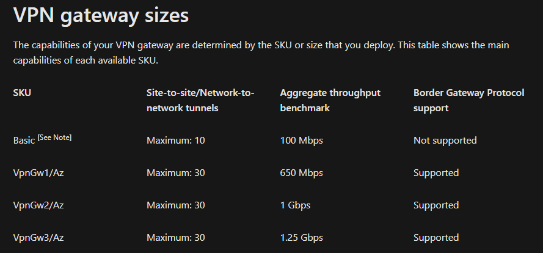
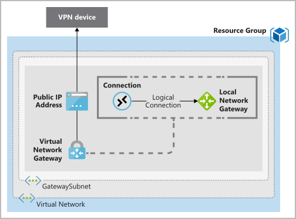
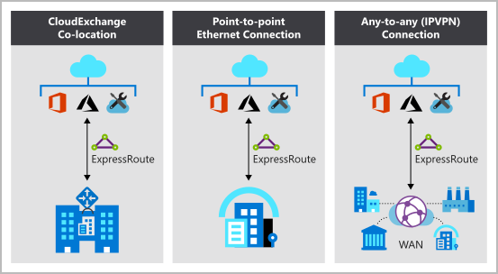

# [Azure Fundamentals part 2: Describe core Azure services](https://docs.microsoft.com/en-us/learn/paths/az-900-describe-core-azure-services/)

### [Explore Azure compute services](https://docs.microsoft.com/en-us/learn/modules/azure-compute-fundamentals/)
- most prominent Azure compute services
    - VMs
        - IaaS
        - simulate computers with an OS already installed
        - everything but the hardware is customizable
        - VM scale sets: a set of identical, load-balanced VMs
    - container instances
        - you can run multiple on a single VM
        - they are virtualized application environments that are set up to run a specific app
        - they are designed to quickly replicate settings for multiple app instances
    - app services
        - PaaS
        - the platform that the app is running on is managed for you
    - Azure functions (for serverless computing)
        - if you just want your code to run, make it an Azure function
        - you don't care about the underlying platform or infrastructure
- when to use VMs
    - custom hosting configurations
    - custom software running on VM
    - you need to update, configure and maintain the software running on the VM
    - you can select a preconfigured VM image
    - examples of when to use VMs
        - use for testing your app on different OSs
        - when running applications on VMs you can easily add/remove VMs as demand increases/decreases
        - when extending an on-premise network
        - during disaster recovery you can use VMs to pick up the slack
    - lift and shift: the process of moving from a physical server to the cloud
        - you can just make an image of the existing server and run that image on a VM
    - Azure batch
        - this is for running large-scale parallel and high-performance computing jobs
        - batch will spin up a pool of VMs, install the necessary apps and data, runs the jobs and then scales down as the work completes
- when to use an app service
    - you can host web apps, background jobs, mobile backends and REST APIs
    - you don't have to configure the environment
    - Azure takes care of scaling
    - continuous deployment from Azure DevOps, GitHub or any Git repo
    - endpoints can be secured
    - hosts web apps using ASP.NET, ASP.NET Core, Java, Ruby, Node.js, PHP or Python on either Windows or Linux
    - API apps have Swagger support
    - WebJobs often run background tasks for your app
    - mobile app: store data, authenticate users, send notifications, execute backend logic
- when to use a container/Kubernetes service
    - containers allow you to run multiple instances of an app on the same VM
    - each container can run your app with different configurations (even a different OS?)
    - containers are managed by a container orchestrator
    - manage containers with
        - Azure container instances
            - PaaS
            - you upload containers and it runs them
        - Azure Kubernetes service
            - for large volumes of containers
            - is an orchestration service
            - it can update containers
            - it can move them to different VMs
            - it can restart failed containers
            - it can manage networking and storage (even sharing data between containers)
    - containers are used to create a microservice architecture
        - each service runs on its own container
        - each container can run a completely different environment that best suits the developers and the purpose of the microservice
        - updates to one microservice don't have to affect the other services
- when to use an Azure function
    - good for event driven logic, i.e. it's usually waiting for input
    - serverless: the infrastructure isn't your responsibility
    - event triggers: timers, HTTP requests, queues, etc.
    - micro-billing: you only pay for the time your function spends actually running
    - Azure functions:
        - can be written in almost any language
        - stateless: behave as if it's restarted every time
        - stateful (durable function): a context is passed into the function to track prior activity
        - you can redeploy the function into a non-serverless environment if the need arises
        - can run locally or in the cloud
    - Azure logic apps
        - built with predefined logic blocks in a graphical web-based editor
        - meant for executing workflows
        - predefined logic blocks exist to integrate with many popular services
        - you can write your own custom connectors
        - runs only in the cloud
- when to use a virtual desktop
    - you can access a cloud-hosted version of Windows from pretty much any device
    - you can protect your data because the user can't leave your files on their personal device since the environment is virtual
    - you can pick to host the VDs near your data centers to reduce load times
    - you can make VDs persistent, e.g. for remote employees
    - user profile appears on the device like a native user (even for Mac/iOS/Android?)
    - load balancing users on your host VM pools (the VMs the desktops are running on)
        - breadth mode: on login, users are spread out across VMs
        - depth mode: users are logged into one VM until it is full then new logins are directed to the next VM
    - if you own a Microsoft 365 or Windows license, you get Windows 10 and 7 desktops and apps for free

### [Explore Azure networking services](https://docs.microsoft.com/en-us/learn/modules/azure-networking-fundamentals/)
- what is Azure virtual networking?
    - key capabilities
        - isolation/segmentation
            - you can create multiple isolated virtual networks (vnets)
            - you can define a private IP address space
            - you can divide the IP addresses into subnets for different parts of the network
        - internet communications
            - a VM can access the internet by default
        - communicate between Azure resources
            - virtual networks: can connect together Azure resources, even VM scale sets
            - service endpoints: you use these to access data resources
        - communicate with on-premise resources
            - point-to-site: a computer outside your network connects to your Azure VPN
            - site-to-site: links your on-premises VPN to your Azure VPN, your Azure devices act like they're on your local network
            - Azure ExpressRoute: provides a dedicated private connection that doesn't travel over the internet, for high security and high bandwidth traffic
        - route network traffic
            - you can create custom routing tables for the subnets on your VPN
            - border gateway protocol (BGP) works with Azure VPN gateways or ExpressRoute to link on-premises BGP routes to Azure virtual networks
        - filter traffic
            - network security group: an Azure resource that can contain inbound and outbound security rules (based on protocol, IP address, port, destination, etc.)
            - network virtual appliances: a VM that can be configured like a network appliance, it can run a firewall, optimize WAN connections, etc.
        - connect virtual networks
            - connect vnets with network peering
            - peering is what enables vnets to talk to each other
            - user defined routing (UDR): user can control routing tables between vnets and between subnets in each network
- Azure vnet settings
    - you can create a vnet from the Azure portal, using the Azure cloud shell or using Azure PowerShell on your local computer
    - things you set when you create a vnet: which resource group it belongs to, location, multiple subnets, DDoS protection, service endpoints, address space (in classless interdomain routing (CIDR) format)
    - additional settings: network security group to define security rules for each subnet, custom routing tables, create peering arrangements to connect vnets
    - you can create an automation script to generate a created vnet
- Azure VPN gateway fundamentals
    - gateways are deployed in an Azure vnet
    - they enable site-to-site, point-to-site and network-to-network connectivity
    - all data is encrypted when it passes through untrusted networks
    - Azure VPN gateways use pre-shared key authentication
    - internet key exchange (IKE) version 1 or 2 sets up the security agreement between the two endpoints, and the IPSec suite encrypts/decrypts the data
    - VPN gateway types
        - policy-based: user specifies which static IP addresses should be encrypted, IKEv1 only
        - route-based: source/destination networks aren't statically defined and instead routing tables are dynamically generated, used to connect vnets
    - 
    - you need these things before you can deploy a gateway
        - vnet
        - GatewaySubnet
        - public IP address
        - local network gateway
        - vnet gateway (can either be a VPN or ExpressRoute gateway)
        - connection resource (to connect the VPN gateway and the local network gateway)
    - 
    - an Azure VPN gateway has an active and a standby instance, the standby instance takes over for the active one if necessary
        - you can also deploy a VPN in an active/active state if you need higher availability
    - you can use an Azure VPN gateway to act as a failsafe for an ExpressRoute gateway
- Azure ExpressRoute fundamentals
    - you use this to establish a connection between your on-premise networks and Azure/Microsoft services without going over any public networks
    - doesn't encryp data though
    - open systems interconnection (OSI) model
        - layer 2: data link layer, node-to-node where the nodes are on the same network
        - layer 3: network layer, addressing and routing between nodes on a multi-node network
    - benefits of ExpressRoute
        - layer 3 connectivity between on-premise and Microsoft networks
        - global connectivity available
        - dynamic routing between you and Microsoft via BGP
        - high reliability with built-in redundancy
    - ExpressRoute global reach
        - connect your networks via two ExpressRoute circuits, one at each location
        - cross traffic will travel through the Microsoft network
    - ExpressRoute connectivity models
        - 
        - colocation: if you're near an internet provider you can request that they connect you directly to Microsoft
        - point-to-point Ethernet: connect your network directly to a Microsoft datacenter via Ethernet
        - any-to-any: Azure can link into your WAN and act as a part of your network

### [Explore Azure Storage services](https://docs.microsoft.com/en-us/learn/modules/azure-storage-fundamentals/)
- Azure Storage is used to store many kinds of files, including files, messages, tables
- types of storage
    - blob storage: for images, videos, documents, etc.
    - file storage: file sharing in the cloud, like connecting to shared folder on your computer
    - disk storage: for you VMs to connect to, similar to accessing on-premises disks, solid and conventional drives available
    - table storage: no SQL, store semi-structured data for cheap
    - queue storage: message queuing for communicating between app components
- storage tiers: hot (frequent access), cool (infrequent access, stored for at least 30 days), archive (long-term data, stored for at least 180 days)
- disk storage fundamentals
    - provides disk storage for VMs
    - the disks act as if they were physically connected to the VM (the VM, in turn, acting like a physical computer)
    - hard disk drives or solid state drives
    - varying performance and storage levels are available
    - IaaS disks with 0% annualized failure rate
- blob storage fundamentals
    - unstructured, meaning you can store whatever you want on there
    - used for massive amounts of data
    - it can handle thousands of simultaneous uploads
    - it can be used to store unconventional formats, like binary data, encrypted data or even a custom format you created
    - ideal for: serving photos to a browser, video/audio, backup/archiving, data for analysis, up to 8 TB for VMs
    - organize blobs with containers
- file storage fundamentals
    - accessible via server message block and network file system
    - any number of Azure VMs can connect to the file storage share
    - it mounts to a computer like any networked disk
    - uses
        - you can mount the file share to an existing letter drive and apps that access that letter drive will now also be able to access the file share
        - store config files on the file share and connect it to multiple VMs
        - dump data into file share to analyze later, even on a different machine
    - Azure files are encrypted and SMB protocol encrypts the data while it's in transit
    - each Azure file has a URL that points to it
    - you can use shared access signature (SAS) tokens to share private files for a specific amount of time
- blob access tiers
    - to save on costs, organize your data based on access frequency and retention period
    - access tiers
        - hot: optimized for storing data that is accessed frequently
        - cool: for data that is infrequently accessed and stored for at least 30 days (e.g. customer invoices)
        - archive: for data that is rarely accessed and stored for at least 180 days (e.g. long-term backups)
    - hot and cool access tiers can be set at the account level
    - archive, hot and cool access tires can be set on each blob
    - data in a cool blob is cheaper to store but more expensive to access
    - data in an archive blob is cheapest to store and is stored offline, which makes it the most expensive tier for actually accessing the data

### [Explore Azure database and analytics services](https://docs.microsoft.com/en-us/learn/modules/azure-database-fundamentals/)
- Azure offers relational, NoSQL and in-memory DBs
- scalability, security and availability is automated
- Azure Cosmos DB
    - supports schema-less data
    - great for constantly changing data
    - at the lowest level Cosmos DB stores data in atom-record-sequence format
    - the data is then projected as an API which you specify
        - choices include MongoDB, SQL, Cassandra, Tables and Gremlin
        - in this case, I guess "API" is referring to the method/syntax/language with which the data is accessed?
- Azure SQL DB
    - relational DB based on the latest version of Microsoft SQL Server engine
    - no need to manage infrastructure, just build your apps that access the data
    - it's a PaaS
    - 99.99% availability
    - has built-in backups
    - allows storage of relational and non-relational data
    - you get the perks of SQL Server, including in-memory tech and intelligent query processing
    - Azure makes it easy to migrate your DB to the cloud using their Migration Assistant
    - after migrating, you just have to change your DB connection strings and you're set!
- Azure DB for MySQL
    - LAMP stack: Linux, Apache, MySQL, PHP
    - based on the MySQL Community Edition engine
    - 99.99% availability service level agreement from Azure
    - built-in security, fault tolerance and data protection
    - point-in-time restore to recover earlier states as far back as 35 days
    - delivers automatic backups, protection for at-rest and in-motion data, enterprise-grade security
    - automatically scales up, you only pay for what you use
- Azure DB for PostgreSQL
    - based on the community version of the open-source PostgreSQL DB engine
    - point-in-time restore to recover earlier states as far back as 35 days
    - automatic scaling up or down
    - delivers automatic backups, protection for at-rest and in-motion data, enterprise-grade security
    - single server deployment
        - comes in basic, general purpose and memory optimized tiers
    - hyperscale (Citus)
        - horizontally scales queries across multiple machines using sharding
            - parallelizes incoming queries across multiple servers
        - offers real-time operational analytics, supports multi-tenant apps, high throughput transactional workloads
- Azure SQL managed instance
    - PaaS DB engine, so it's a fully-managed environment
    - 99.99% uptime SLA
    - automated backup and configurable backup retention periods
    - example of when you'd want a SQL managed instance: your DB uses Cyrillic characters so the data can't be stored in an Azure SQL DB
- big data and analytics
    - Azure Synapse Analytics
        - limitless analytics service
        - query data using serverless or provisioned (?) resources
        - you ingest, prepare, manage and serve the data all with this one service
    - Azure HDInsight
        - you can run popular open-source frameworks
        - you can create cluster types (Apache Spark, Apache Hadoop, Apache Kafka, Apache HBase, Apache Storm, Machine Learning Services)
        - supports extraction, transformation, loading (ETL)(?), warehousing, machine learning and IoT
    - Azure Databricks
        - unlock insights and build artificial intelligence solutions
        - Apache Spark environment
        - autoscale and collaborate in an interactive workspace
        - supports Python, Scala, R, Java and SQL
        - supports frameworks including TensorFlow, PyTorch and scikit-learn
    - Azure Data Lake Analytics
        - on-demand analytics service
        - you write the queries to transform your data and extract insights
        - handles jobs of any scale
        - you only pay for the time your job spends running
